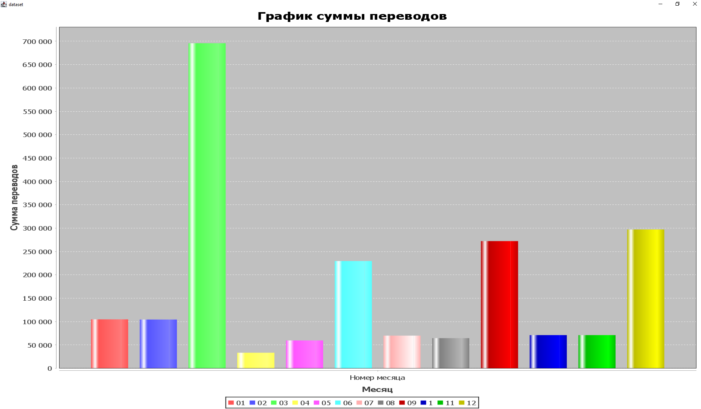

#Итоговый проект


Сначала создаем POJO-объект remittance - объект одной записи
```
public class Remittance {
    private String reference;
    private String period;
    private Double value;
    private String status;
    private String units;
    private int magnitude;
    private String subject;
    private String group;
    private String series_title1;
    private String series_title2;

    public Remittance(String reference, String period, Double value, String status, String units, int magnitude, String subject, String group, String series_title1, String series_title2) {
        this.reference = reference;
        this.period = period;
        this.value = value;
        this.status = status;
        this.units = units;
        this.magnitude = magnitude;
        this.subject = subject;
        this.group = group;
        this.series_title1 = series_title1;
        this.series_title2 = series_title2;
    }
}

```
Парсим данные csv-файла. Для этого создаем специальный класс DataParse
```
public class DataParse {
    public static ArrayList<Remittance> remittances = new ArrayList<>();

    public static void ParseData(String path)
    {
        try (BufferedReader br = Files.newBufferedReader(Paths.get(path))) {
            String line = br.readLine();
            while ((line = br.readLine())!=null){
                double data_value = 0;
                String[] values = line.split(",");
                if (!values[2].isEmpty())
                {
                    data_value = Double.parseDouble(values[2]);
                }
                remittances.add(new Remittance(
                        values[0],values[1],data_value,values[4],values[5],Integer.parseInt(values[6]),values[7],values[8],values[9],values[10]));

            }
        } catch (Exception e) {
            e.printStackTrace();
        }
    }
}

```
Все записи с csv-файла находятся в массиве remittances, из которого мы будем записывать данные
в нашу базу данных

Создаем класс SqliteWork, в котором будет проводиться вся остальная работа, и в нем
создадим статический метод Initialize,создающий таблицы для нашей базы данных
```
public class SqliteWork {

    public static void Initialize(){
        try{
            Class.forName("org.sqlite.JDBC");
            Connection cn = DriverManager.getConnection("jdbc:sqlite:remittances.db");
            Statement st = cn.createStatement();
            String table_1 = "CREATE TABLE remittance(id INTEGER PRIMARY KEY AUTOINCREMENT,period VARCHAR(10),value DOUBLE)";
            String table_2 = "CREATE TABLE remittanceInfo(id INTEGER PRIMARY KEY AUTOINCREMENT," +
                    "reference VARCHAR(15)," +
                    "status VARCHAR(5)," +
                    "units VARCHAR(10)," +
                    "magnitude DOUBLE," +
                    "subject VARCHAR(25)," +
                    "'group' VARCHAR(255)," +
                    "title1 VARCHAR(15)," +
                    "title2 VARCHAR(30)," +
                    "FOREIGN KEY (id) REFERENCES remittance(id))";
            st.execute(table_1);
            st.execute(table_2);
        }
        catch (Exception e){
            e.printStackTrace();
        }
    }
}
```
Так как некоторые поля в csv-файле были пустые, мы их не будем вписывать в наши таблицы(Series_title 3...5 и Suppressed)

Создаем в классе SqliteWork два метода для вставки данных в наши таблицы:
```
public static void InsertDataRemittance() {
        try {
            Class.forName("org.sqlite.JDBC");
            Connection cn = DriverManager.getConnection("jdbc:sqlite:remittances.db");
            Statement st = cn.createStatement();

            for (Remittance remittance : DataParse.remittances) {
                st.execute("INSERT INTO remittance(period,value) VALUES("+remittance.getPeriod()+","+remittance.getValue()+")");

            }
        } catch (Exception e) {
            e.printStackTrace();
        }
    }

    public static void InsertDataRemittanceInfo()
    {
        try {
            Class.forName("org.sqlite.JDBC");
            Connection cn = DriverManager.getConnection("jdbc:sqlite:remittances.db");
            String text = "INSERT INTO remittanceInfo(reference,status,units,magnitude,subject,'group',title1,title2) " +
                    "VALUES(?,?,?,?,?,?,?,?)";
            for (Remittance remittance : DataParse.remittances) {
                PreparedStatement statement = cn.prepareStatement(text);
                statement.setString(1, remittance.getReference());
                statement.setString(2, remittance.getStatus());
                statement.setString(3, remittance.getUnits());
                statement.setDouble(4,remittance.getMagnitude());
                statement.setString(5, remittance.getSubject());
                statement.setString(6,remittance.getGroup());
                statement.setString(7, remittance.getSeries_title1());
                statement.setString(8,remittance.getSeries_title2());
                statement.executeUpdate();
            }
        } catch (Exception e) {
            e.printStackTrace();
        }
    }

```

Теперь все данные заполнены в базу данных и можно приступать к выполнению заданий.

В первом задании необходимо построить график соотношения суммы всех переводов по месяцам в 2020 году.
Для это создадим в классе SqliteWork метод HistogramData.Построение графиков реализовано с помощью
Jfreechart 
```
 public static void HistogramData(){
        try {
            Class.forName("org.sqlite.JDBC");
            Connection con = DriverManager.getConnection("jdbc:sqlite:remittances.db");
            Statement statement = con.createStatement();
            var dataset = new DefaultCategoryDataset();
            var rs = statement.executeQuery("SELECT substr(period,6,9) as month,sum(VALUE) FROM remittance INNER JOIN remittanceInfo ON remittanceInfo.id = remittance.id WHERE substr(period,0,5) = '2020' AND units = 'Dollars' GROUP BY month");
            while (rs.next())
            {
                System.out.println(rs.getString(1)+"--"+rs.getString(2));
                dataset.addValue(rs.getDouble(2),rs.getString(1),"Номер месяца");
            }
            JFreeChart chart = ChartFactory.createBarChart("График суммы переводов","Месяц","Сумма переводов",dataset);
            ChartFrame chartFrame = new ChartFrame("dataset",chart);
            chartFrame.setVisible(true);
        }
        catch (Exception e){
            e.printStackTrace();
        }
    }
```

При выполнении данного метода в консоль выведется сумма переводов, сгрупированная по месяцам и нужный нам график
```

SqliteWork.HistogramData();

       ---

01--104909.0
02--104423.5
03--695830.2
04--33460.3
05--59653.9
06--229693.3
07--70070.8
08--64658.8
09--272338.3
1--71122.6
11--71094.1
12--297141.3
```


Во втором задании нужно вывести в консоль средний размер перевода в долларах и их количество за уникальный период

В методе AverageData посредством SQL-запроса реализуем данное задание:
```

    public static void AverageData(){
        try {
            Class.forName("org.sqlite.JDBC");
            Connection con = DriverManager.getConnection("jdbc:sqlite:remittances.db");
            Statement statement = con.createStatement();
           var rs = statement.executeQuery("SELECT period,avg(value) as a ,count(value) as b FROM remittance INNER JOIN remittanceInfo ON remittanceInfo.id = remittance.id WHERE units = 'Dollars' GROUP BY period");
            while(rs.next()){
                System.out.println("Период:"+rs.getString(1)+", Средний размер перевода за период:"+rs.getString(2)+", Количество переводов:"+rs.getString(3));
            }
        }
        catch(Exception e){
            e.printStackTrace();
        }
    }


```
В итоге в консоль выведется следующее:
```
...
Период:2003.05, Средний размер перевода за период:974.8625, Количество переводов:40
Период:2003.06, Средний размер перевода за период:1920.33456790123, Количество переводов:81
Период:2003.07, Средний размер перевода за период:990.7975, Количество переводов:40
Период:2003.08, Средний размер перевода за период:993.905, Количество переводов:40
...
```

Третье задание также выполняется посредством SQL-запроса в методе MaxMinData:
```
  public static void MaxMinData(){
        try{
            Class.forName("org.sqlite.JDBC");
            Connection con = DriverManager.getConnection("jdbc:sqlite:remittances.db");
            Statement statement = con.createStatement();
             var rs = statement.executeQuery("SELECT MAX(value),MIN(value) FROM remittance INNER JOIN remittanceInfo ON remittanceInfo.id = remittance.id WHERE substr(period,0,5) IN ('2020','2014','2016') AND units = 'Dollars'");
            while(rs.next())
            {
                System.out.println("Максимальный перевод за периоды:"+rs.getString(1));
                System.out.println("Минимальный перевод за периоды:"+rs.getString(2));
            }
        }catch(Exception e){
            e.printStackTrace();
        }
    }
```
Вывод консоли:
```
Максимальный перевод за периоды:93968.7
Минимальный перевод за периоды:0.0
```